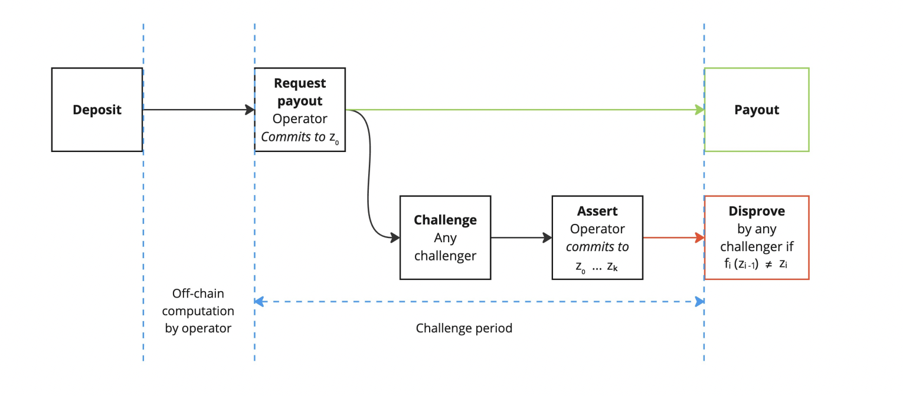

## Proof Verification Overview

Once a proof attesting to the correct execution of a computation is generated, the verifier checks whether the proof is valid. Verification requires four components: 

- the verifying key: vk
- the proof itself: π
- the public inputs: x
- the result of the computation: y

For zkVMs, both the proving and verifying keys are generated from the compiled ELF binary. The proving key, together with the inputs (x), is used to generate the proof (π), which attests that the program executed correctly on the given inputs and produced the claimed output (y). Here, `P(pk, x) = π`. 

Verification then checks that the proof, verifying key, inputs, and outputs are consistent. If the verification function `V(vk, x, y, π)` evaluates to true, the proof is accepted; otherwise, it is rejected.

The verifying key is produced during the key generation phase, alongside the proving key used by the prover. A 32-byte verifying key hash serves as a unique identifier, binding the proof to a specific compiled guest program and preventing it from being validated under another program’s key. You can retrieve a program’s verifying key with:

```bash
cargo run --release --bin vkey
```

## On-chain verification

Ziren enables users to post and verify proofs directly on-chain. A verifier smart contract encodes the verifying key and verification logic, allowing anyone to check a proof against the declared public inputs.

When a proof and its public inputs are submitted to the verifier contract, the contract performs checks to ensure the inputs match those committed in the proof. If successful, the contract returns true; otherwise, it reverts. This approach lets applications run heavy computations off-chain, generate a succinct proof, and then verify it on-chain. Gas fees are only incurred for verification, not for executing the full computation. 

Verification costs remain constant regardless of the size of the original computation. Because STARK proofs are too large to be efficiently verified on Ethereum, Ziren wraps them into Groth16 or PLONK proofs, both of which are succinct and EVM-friendly. STARK proofs are typically hundreds of kilobytes, while Groth16 proofs are only a few hundred bytes. By shrinking the proof to a more succinct format, they are more feasible to verify. Groth16 and PLONK also offer constant-time verification (O(1)) independent of circuit size, making them practical for on-chain use.

The advantage of this is rather than incurring direct gas costs for your application’s logic during execution, you can simply execute off-chain and verify your proof on-chain, paying for gas only when requesting a proof and the callback. Since verification costs remain constant regardless of the size of the original computation, whether the proof represents a small Fibonacci calculation or millions of execution steps, the gas cost depends only on the proof and the size of the public outputs (y).

Ziren currently offers the capability to post and verify a proof on testnet e.g., Sepolia. Support for on-chain verification contracts deployed on additional chains is coming soon.

### Verifier Contracts in the Project Template

Ziren’s project template includes sample verifier contracts, forge scripts for deploying contracts, and Foundry tests to validate verifier functionality prior to deployment (which incurs gas costs). These include:

- **IZKMVerifier** — a verifier interface.
- **Fibonacci.sol** — an example application contract verifying a proof for a Fibonacci guest program.
- **ZKMVerifierGroth16.sol** and **ZKMVerifierPlonk.sol** — verifier instances that enforces the `VERIFIER_HASH` selector, decodes inputs and calls the corresponding proof system verifier.
- **Groth16Verifier.sol** and **PLONKVerifier.sol** — the contracts implementing the cryptographic verification logic of the underlying proof system.

The following is `IZKMVerifier.sol`, Ziren’s verifier interface:

```rust
// SPDX-License-Identifier: MIT
pragma solidity ^0.8.20;

/// @title zkMIPS Verifier Interface
/// @author ZKM
/// @notice This contract is the interface for the zkMIPS Verifier.
interface IZKMVerifier {
    /// @notice Verifies a proof with given public values and vkey.
    /// @dev It is expected that the first 4 bytes of proofBytes must match the first 4 bytes of
    /// target verifier's VERIFIER_HASH.
    /// @param programVKey The verification key for the MIPS program.
    /// @param publicValues The public values encoded as bytes.
    /// @param proofBytes The proof of the program execution the zkMIPS zkVM encoded as bytes.
    function verifyProof(bytes32 programVKey, bytes calldata publicValues, bytes calldata proofBytes) external view;
}

interface IZKMVerifierWithHash is IZKMVerifier {
    /// @notice Returns the hash of the verifier.
    function VERIFIER_HASH() external pure returns (bytes32);
}
```

The `verifyProof` function takes the vkey, public values and proof as arguments. `VERIFIER_HASH` is a guardrail-type check that verifies that the first 4 bytes of the proof matches the first 4 bytes of the verifier hash. This provides a pre-check to prevent misrouted proofs and ensuring that Groth16 proofs are fed into a Groth16 verifier, PLONK proofs are fed into a PLONK verifier, etc. 

The `IZKMVerifier.sol`interface can be used in a verifier contract. An example of its implementation can be found in the following verifier contract for the Fibonacci example: 

```rust
// SPDX-License-Identifier: MIT
pragma solidity ^0.8.20;

import {IZKMVerifier} from "./IZKMVerifier.sol";

struct PublicValuesStruct {
    uint32 n;
    uint32 a;
    uint32 b;
}

/// @title Fibonacci.
/// @author ZKM
/// @notice This contract implements a simple example of verifying the proof of a computing a
///         fibonacci number.
contract Fibonacci {
    /// @notice The address of the zkMIPS verifier contract.
    /// @dev This is a specific ZKMVerifier for a specific version.
    IZKMVerifier public verifier;

    /// @notice The verification key for the fibonacci program.
    bytes32 public fibonacciProgramVKey;

    constructor(IZKMVerifier _verifier, bytes32 _fibonacciProgramVKey) {
        verifier = _verifier;
        fibonacciProgramVKey = _fibonacciProgramVKey;
    }

    /// @notice The entrypoint for verifying the proof of a fibonacci number.
    /// @param _proofBytes The encoded proof.
    /// @param _publicValues The encoded public values.
    function verifyFibonacciProof(bytes calldata _publicValues, bytes calldata _proofBytes)
        public
        view
        returns (uint32, uint32, uint32)
    {
        IZKMVerifier(verifier).verifyProof(fibonacciProgramVKey, _publicValues, _proofBytes);
        PublicValuesStruct memory publicValues = abi.decode(_publicValues, (PublicValuesStruct));
        return (publicValues.n, publicValues.a, publicValues.b);
    }
}
```

Application contracts like `**Fibonacci.sol**` use the verifier interface, in addition to the verifying key, public values and proof bytes to call a deployed contract verifier such as `ZKMVerifierGroth16.sol` or `ZKMVerifierPlonk.sol`. If verification succeeds, the contract decodes and returns the public values. If it fails, the call reverts.

There are two verifier instance contracts: `ZKMVerifierGroth16.sol` and `ZKMVerifierPlonk.sol`. The following is the contract for `ZKMVerifierGroth16.sol`: 

```rust
// SPDX-License-Identifier: MIT
pragma solidity ^0.8.20;

import {IZKMVerifier, IZKMVerifierWithHash} from "../IZKMVerifier.sol";
import {Groth16Verifier} from "./Groth16Verifier.sol";

/// @title zkMIPS Verifier
/// @author ZKM
/// @notice This contracts implements a solidity verifier for zkMIPS.
contract ZKMVerifier is Groth16Verifier, IZKMVerifierWithHash {
    /// @notice Thrown when the verifier selector from this proof does not match the one in this
    /// verifier. This indicates that this proof was sent to the wrong verifier.
    /// @param received The verifier selector from the first 4 bytes of the proof.
    /// @param expected The verifier selector from the first 4 bytes of the VERIFIER_HASH().
    error WrongVerifierSelector(bytes4 received, bytes4 expected);

    /// @notice Thrown when the proof is invalid.
    error InvalidProof();

    function VERSION() external pure returns (string memory) {
        return "v1.0.0";
    }

    /// @inheritdoc IZKMVerifierWithHash
    function VERIFIER_HASH() public pure returns (bytes32) {
        return 0xc7bd17e8b69c0f5d28ad39a60019df51079a6aa160013bc4a4485219a97fec97;
    }

    /// @notice Hashes the public values to a field elements inside Bn254.
    /// @param publicValues The public values.
    function hashPublicValues(bytes calldata publicValues) public pure returns (bytes32) {
        return sha256(publicValues) & bytes32(uint256((1 << 253) - 1));
    }

    /// @notice Verifies a proof with given public values and vkey.
    /// @param programVKey The verification key for the MIPS program.
    /// @param publicValues The public values encoded as bytes.
    /// @param proofBytes The proof of the program execution the zkMIPS zkVM encoded as bytes.
    function verifyProof(bytes32 programVKey, bytes calldata publicValues, bytes calldata proofBytes) external view {
        bytes4 receivedSelector = bytes4(proofBytes[:4]);
        bytes4 expectedSelector = bytes4(VERIFIER_HASH());
        if (receivedSelector != expectedSelector) {
            revert WrongVerifierSelector(receivedSelector, expectedSelector);
        }

        bytes32 publicValuesDigest = hashPublicValues(publicValues);
        uint256[2] memory inputs;
        inputs[0] = uint256(programVKey);
        inputs[1] = uint256(publicValuesDigest);
        uint256[8] memory proof = abi.decode(proofBytes[4:], (uint256[8]));
        this.Verify(proof, inputs);
    }
```

This contract executes a series of checks to determine whether a proof is valid. If all checks pass, the proof is accepted. The verification process includes:

- An initial guardrail check to ensure proof type compatibility by checking that the first 4 bytes of `proofBytes` match the contract’s `VERIFIER_HASH`.
- Confirming that the proof is tied to the correct program verifying key (`programVKey`), such as Fibonacci’s vKey.
- Checking that the proof’s embedded public inputs match the declared public output bytes of the guest program.
- Delegating to the appropriate underlying proof-system verifier, either `Groth16Verifier` or `PlonkVerifier`.

The `Groth16Verifier` and `PlonkVerifier` contracts implement the core cryptographic logic for their respective proof systems. For example, `Groth16Verifier` performs pairing checks over bn128 precompiles.

Deployment scripts for these verifiers are provided in the contracts > scripts directory. Specifically, `ZKMVerifierGroth16.s.sol` and `ZKMVerifierPlonk.s.sol` deploy the corresponding verifier contracts.

Below is the `ZKMVerifierGroth16.s.sol` script:

```rust
// SPDX-License-Identifier: UNLICENSED
pragma solidity ^0.8.13;

import {Script, console} from "forge-std/Script.sol";
import {ZKMVerifier} from "../src/v1.0.0/ZKMVerifierGroth16.sol";

contract ZKMVerifierGroth16Script is Script {
    ZKMVerifier public verifier;

    function setUp() public {}

    function run() public {
        vm.startBroadcast();

        verifier = new ZKMVerifier();

        vm.stopBroadcast();
    }
}
```

The Forge script deploys the selected verifier contract ( `ZKMVerifierGroth16.sol`) to a target network. The script starts broadcasting, deploys the verifier, then stops broadcasting while recording the verification time. Once completed, the deployed verifier’s address is outputted.

From the end-user perspective, contracts can be deployed and bytecode published using the Forge script command. For example:

```bash
forge script scripts/ZKMVerifierGroth16.sol:ZKMVerifierGroth16 \
  --rpc-url $RPC_URL --private-key $PK --broadcast
```

This command executes the script and deploys the `ZKMVerifierGroth16` contract to the specified network.

Running this process locally (without broadcasting) simulates an EVM call against the deployed verifier contract. This is considered off-chain verification, since the verification logic executes locally and only returns the result.

When deployed, the verifier logic is placed on Ethereum at a specific contract address, making proof verification publicly accessible. The main value proposition of on-chain deployment is **public verifiability**: once the verifier is live, anyone can call it with `programVKey`, `publicValues`, and `proofBytes`.

The deployed contract points to the correct verifier implementation (e.g., `ZKMVerifierGroth16`), and users interact with it by calling the `verifyProof()` function.

The prof lifecycle for EVM-based verification is as follows:

1. After proof generation, the proof bytes, verifying key, and public values are submitted in a transaction to the deployed verifier contract (e.g., `ZKMVerifierGroth16`).
2. Full nodes execute the verifier contract, checking that the proof matches the verifying key, that the public values are consistent, and that all cryptographic constraints of the proof system hold.
3. If the proof is valid, the call succeeds and Ethereum records the result in its state. If invalid, the transaction reverts.

Although verification incurs a gas cost it runs in constant time where the cost is independent of the size of the original computation.

## Off-chain verification

In addition to on-chain verification through deployed verifier contracts, Ziren offer off-chain verification for all supported proof systems.

Off-chain verification allows developers to check STARK (core and compressed), PLONK, and Groth16 proofs directly, without incurring gas. This approach also avoids the overhead of STARK-to-SNARK wrapping, since STARK proofs can also be verified natively.

Because the verification runs on a local CPU rather than on-chain, the process does not costs related to gas (unlike EVM-based verification) or dispute resolution (unlike BitVM-based verification). However, unlike on-chain verification, off-chain verification is not publicly verifiable. The result is only visible locally to the entity performing the check.

### **WASM Verification**

Ziren provides WASM bindings for verifying Groth16, PLONK, and STARK proofs in-browser. These bindings are generated from Rust functions in the `zkm_verifier` crate and exposed to JavaScript via `wasm_bindgen`. See the [ziren-wasm-verifier](https://github.com/ProjectZKM/ziren-wasm-verifier) repository for setup instructions.

The repository includes the following: 

- The **guest program** (with an example on computing the Fibonacci sequence) takes an input `n`, commits it to the public values, computes the sequence, and writes outputs (`a`, `b`) to public values via zkVM syscalls.
- The **host program** compiles the guest to an ELF using `zkm_build`, runs setup with `ProverClient`, generates the proof, and saves the proof, public values, and verifying key hash.
- The **verifier directory** wraps the Rust verifier functions with `wasm_bindgen` so they can be invoked from JavaScript after running `wasm-pack build`.

The following is an example verifier wrapper (`verifier/lib.rs`):

```rust
//! A simple wrapper around the `zkm_verifier` crate.

use wasm_bindgen::prelude::wasm_bindgen;
use zkm_verifier::{
    Groth16Verifier, PlonkVerifier, StarkVerifier, GROTH16_VK_BYTES, PLONK_VK_BYTES,
};

/// Wrapper around [`zkm_verifier::StarkVerifier::verify`].
#[wasm_bindgen]
pub fn verify_stark(proof: &[u8], public_inputs: &[u8], zkm_vk: &[u8]) -> bool {
    StarkVerifier::verify(proof, public_inputs, zkm_vk).is_ok()
}

/// Wrapper around [`zkm_verifier::Groth16Verifier::verify`].
///
/// We hardcode the Groth16 VK bytes to only verify Ziren proofs.
#[wasm_bindgen]
pub fn verify_groth16(proof: &[u8], public_inputs: &[u8], zkm_vk_hash: &str) -> bool {
    Groth16Verifier::verify(proof, public_inputs, zkm_vk_hash, *GROTH16_VK_BYTES).is_ok()
}

/// Wrapper around [`zkm_verifier::PlonkVerifier::verify`].
///
/// We hardcode the Plonk VK bytes to only verify Ziren proofs.
#[wasm_bindgen]
pub fn verify_plonk(proof: &[u8], public_inputs: &[u8], zkm_vk_hash: &str) -> bool {
    PlonkVerifier::verify(proof, public_inputs, zkm_vk_hash, *PLONK_VK_BYTES).is_ok()
}

```

All Rust functions in the `zkm_verifier` crate encoding the verification logic for the proof systems are wrapped to generate WASM bindings. 

The repository also contains a few examples. The `wasm_example` script demonstrates verifying proofs in Node.js: 

```rust
/**
 * This script verifies the proofs generated by the script in `example/host`.
 *
 * It loads json files in `example/json` and verifies them using the wasm bindings
 * in `example/verifier/pkg/zkm_wasm_verifier.js`.
 */

import * as wasm from "../../verifier/pkg/zkm_wasm_verifier.js"
import fs from 'node:fs'
import path from 'node:path'

// Convert a hexadecimal string to a Uint8Array
export const fromHexString = (hexString) =>
    Uint8Array.from(hexString.match(/.{1,2}/g).map((byte) => parseInt(byte, 16)));

const files = fs.readdirSync("../json");

// Iterate through each file in the data directory
for (const file of files) {
    try {
        // Read and parse the JSON content of the file
        const fileContent = fs.readFileSync(path.join("../json", file), 'utf8');
        const proof_json = JSON.parse(fileContent);

        // Determine the ZKP type (Groth16 or Plonk) based on the filename
        const file_name = file.toLowerCase();
        const zkpType = file_name.includes('groth16') ? 'groth16' : file_name.includes('plonk')? 'plonk' : 'stark';
        const proof = fromHexString(proof_json.proof);
        const public_inputs = fromHexString(proof_json.public_inputs);
        const vkey_hash = proof_json.vkey_hash;

        // Get the values using DataView.
        const view = new DataView(public_inputs.buffer);

        // Read each 32-bit (4 byte) integer as little-endian
        const n = view.getUint32(0, true);
        const a = view.getUint32(4, true);
        const b = view.getUint32(8, true);

        console.log(`n: ${n}`);
        console.log(`a: ${a}`);
        console.log(`b: ${b}`);

        if (zkpType == 'stark') {
            const vkey = fromHexString(proof_json.vkey);

            const startTime = performance.now();
            const result = wasm.verify_stark(proof, public_inputs, vkey);
            const endTime = performance.now();
            console.log(`${zkpType} verification took ${endTime - startTime}ms`);
            console.assert(result, "result:", result, "proof should be valid");
            console.log(`Proof in ${file} is valid.`);
        } else {
            // Select the appropriate verification function and verification key based on ZKP type
            const verifyFunction = zkpType === 'groth16' ? wasm.verify_groth16 : wasm.verify_plonk;

            const startTime = performance.now();
            const result = verifyFunction(proof, public_inputs, vkey_hash);
            const endTime = performance.now();
            console.log(`${zkpType} verification took ${endTime - startTime}ms`);
            console.assert(result, "result:", result, "proof should be valid");
            console.log(`Proof in ${file} is valid.`);
        }
    } catch (error) {
        console.error(`Error processing ${file}: ${error.message}`);
    }
}
```

The following logic is included in the script: 

- Loads proof JSON files from `example/json/`.
- Decodes hex-encoded proof and public inputs.
- Dispatches verification to the appropriate WASM binding (`verify_stark`, `verify_groth16`, or `verify_plonk`).

STARK verification requires converting the verifying key to bytes and passing it explicitly, while Groth16 and PLONK require the `vkey_hash`.

This example logs:

- Input values (n, a, b)
- Verification time (in ms)
- Whether the proof is valid

The `eth_wasm` example demonstrates **in-browser STARK verification for Ethereum block proofs** as part of the [EthProofs](https://ethproofs.org/?utm_source=chatgpt.com) initiate. 

main.js: 

```jsx
/**
 * This script verifies the proofs generated by the script in `example/host`.
 *
 * It loads json files in `example/json` and verifies them using the wasm bindings
 * in `example/verifier/pkg/zkm_wasm_verifier.js`.
 */

import * as wasm from "../../verifier/pkg/zkm_wasm_verifier.js"
import fs from 'node:fs'

const vkey = fs.readFileSync('../binaries/eth_vk.bin');

// Download the proof from https://ethproofs.org/blocks/23174100 > ZKM
const proof = fs.readFileSync('../binaries/23174100_ZKM_167157.txt');

const startTime = performance.now();
const result = wasm.verify_stark_proof(proof, vkey);
const endTime = performance.now();

console.log(`stark verification took ${endTime - startTime}ms`);
console.assert(result, "result:", result, "proof should be valid");
console.log(`ETH proof is valid.`);
```

The script’s main functions are:

- Loading the verifier WASM module with Rust bindings
- Reading the verifying key
- Reading the Ethereum block proof file
- Calling the `verify_stark_proof` function
- Measuring verification time
- Checking whether the proof is valid

The script in the `example/binaries` directory demonstrates these steps using a STARK verifying key downloaded from the Ziren prover network and a sample proof from EthProofs, which attests that Ethereum Block `23,174,000` was executed correctly. Users can also download and run in-browser verification for Ziren directly from [EthProofs](https://ethproofs.org/clusters/84a01f4b-8078-44cf-b463-90ddcd124960?utm_source=chatgpt.com). The verification process uses the WASM bindings generated by `wasm-pack build`, which expose the `verify_stark_proof` function wrapping the Rust `StarkVerifier`.

During execution, the script records start and end times to measure verification latency. The call `wasm.verify_stark_proof(proof, vkey)` runs verification in WASM by parsing the proof bytes, checking the proof against the verifying key, and confirming correctness.

Unlike the generic `wasm_example`, which requires passing explicit public outputs to `verify_stark`, the EthProofs example uses only the `verify_stark_proof` function. Here, all relevant public data is embedded directly within the proof. The verifier checks that the proof is valid against the verifying key and that the committed public inputs are consistent with the proof itself. This design removes the need to pass public inputs separately, reducing overhead and making block-level verification faster.

The EthProofs project uses a modified version of the WASM verifier, published as an npm package: [@ethproofs/ziren-wasm-stark-verifier](https://www.npmjs.com/package/@ethproofs/ziren-wasm-stark-verifier?utm_source=chatgpt.com).

Using the fibonacci example, the expected output including the public inputs used, verification time and confirmation of the proof’s validity is as follows: 

```rust
n: 1000
a: 5965
b: 3651
groth16 verification took 10827.951916999999ms
Proof in fibonacci_groth16_proof.json is valid.
n: 1000
a: 5965
b: 3651
plonk verification took 20315.557584000002ms
Proof in fibonacci_plonk_proof.json is valid.
n: 1000
a: 5965
b: 3651
stark verification took 30252.595458ms
Proof in fibonacci_stark_proof.json is valid.
```

### **no_std Verification**

Ziren also supports verifying STARK, Groth16, and PLONK proofs in no_std environments, making it possible to run proof verification logic without depending on the Rust standard library. This allows the verifier to:

1. Run in resource-constrained or bare-metal environments. 
2. Execute inside the zkVM as a guest program. 

This approach is especially useful for off-chain computation pipelines, such as client-side verification or pre-verification before submitting proofs on-chain.

This approach is especially useful for off-chain computation pipelines, such as client-side verification or pre-verification before submitting proofs on-chain.

In the no_std model, the verifier itself is compiled as a guest binary and executed inside the zkVM. The workflow is as follows:

1. Compile the verifier guest in Rust (no_std style). The guest reads inputs, runs the verifier logic, and prints success/failure.
2. Provide inputs via `ZKMStdin` stream from the host. These include proof bytes, public values, and the verifying key hash.
3. Execute inside zkVM. The host runs the verifier guest program in the zkVM.

Because all no_std targets run outside of a full OS runtime, verification is performed entirely off-chain. Additionally, recursive verification is possible: a verifier guest can itself be wrapped in a proof, producing a proof-of-verification. This enables recursive proof composition.

As an example of using no_std verification for verifying Groth16 proofs, see the [groth16 example](https://github.com/ProjectZKM/Ziren/tree/main/examples/groth16).

The following is the host program implementation for a Groth16 proof of the Fibonacci program: 

```rust
//! A script that generates a Groth16 proof for the Fibonacci program, and verifies the
//! Groth16 proof in ZKM.

use zkm_sdk::{include_elf, utils, HashableKey, ProverClient, ZKMStdin};

/// The ELF for the Groth16 verifier program.
const GROTH16_ELF: &[u8] = include_elf!("groth16-verifier");

/// The ELF for the Fibonacci program.
const FIBONACCI_ELF: &[u8] = include_elf!("fibonacci");

/// Generates the proof, public values, and vkey hash for the Fibonacci program in a format that
/// can be read by `zkm-verifier`.
///
/// Returns the proof bytes, public values, and vkey hash.
fn generate_fibonacci_proof() -> (Vec<u8>, Vec<u8>, String) {
    // Create an input stream and write '20' to it.
    let n = 20u32;

    // The input stream that the program will read from using `zkm_zkvm::io::read`. Note that the
    // types of the elements in the input stream must match the types being read in the program.
    let mut stdin = ZKMStdin::new();
    stdin.write(&n);

    // Create a `ProverClient`.
    let client = ProverClient::new();

    // Generate the groth16 proof for the Fibonacci program.
    let (pk, vk) = client.setup(FIBONACCI_ELF);
    println!("vk: {:?}", vk.bytes32());
    let proof = client.prove(&pk, stdin).groth16().run().unwrap();
    (proof.bytes(), proof.public_values.to_vec(), vk.bytes32())
}

fn main() {
    // Setup logging.
    utils::setup_logger();

    // Generate the Fibonacci proof, public values, and vkey hash.
    let (fibonacci_proof, fibonacci_public_values, vk) = generate_fibonacci_proof();

    // Write the proof, public values, and vkey hash to the input stream.
    let mut stdin = ZKMStdin::new();
    stdin.write_vec(fibonacci_proof);
    stdin.write_vec(fibonacci_public_values);
    stdin.write(&vk);

    // Create a `ProverClient`.
    let client = ProverClient::new();

    // Execute the program using the `ProverClient.execute` method, without generating a proof.
    let (_, report) = client.execute(GROTH16_ELF, stdin).run().unwrap();
    println!("executed groth16 program with {} cycles", report.total_instruction_count());
    println!("{}", report);
}
```

The host compiles and proves a target program (e.g., Fibonacci) to generate the proof, public values, and verifying key. These values are serialized and written to the zkVM input channel (ZKMStdin). The host then executes the verifier guest ELF inside the zkVM, reading the inputs from stdin and verifying the proof with `client.prove(&pk, stdin).groth16().run().unwrap().`

The following is the corresponding guest program implementation: 

```rust
//! A program that verifies a Groth16 proof in ZKM.

#![no_main]
zkm_zkvm::entrypoint!(main);

use zkm_verifier::Groth16Verifier;

pub fn main() {
    // Read the proof, public values, and vkey hash from the input stream.
    let proof = zkm_zkvm::io::read_vec();
    let zkm_public_values = zkm_zkvm::io::read_vec();
    let zkm_vkey_hash: String = zkm_zkvm::io::read();

    // Verify the groth16 proof.
    let groth16_vk = *zkm_verifier::GROTH16_VK_BYTES;
    println!("cycle-tracker-start: verify");
    let result = Groth16Verifier::verify(&proof, &zkm_public_values, &zkm_vkey_hash, groth16_vk);
    println!("cycle-tracker-end: verify");

    match result {
        Ok(()) => {
            println!("Proof is valid");
        }
        Err(e) => {
            println!("Error verifying proof: {:?}", e);
        }
    }
}
```

The guest reads all the inputs, including the proof, public values and verifying key hash from ZKMStdin provided by the host. The guest then runs `Groth16Verifier::verify` checking that: 

- The proof is valid for the given circuit (`groth16_vk`)
- The committed public values match those in the proof
- The verifying key hash matches

## BitVM Verifier

BitVM-based verification combines both off-chain and on-chain steps depending on the phase of the process. Ziren integrates with GOAT Network’s BitVM2 node to support verification in a Bitcoin-native environment, which allows ZK proofs to ultimately inherit Bitcoin’s security guarantees.

Ziren generates a proof for each L2 block, which is then ingested and stored by the BitVM2 node. These individual block proofs are recursively aggregated, and can be wrapped (for example into Groth16 format) to support other verification environments. BitVM2 implements an optimistic fraud-proof mechanism. In the default case, proofs are accepted based on off-chain checks and periodic sequencer commitments. If, however, an invalid proof is suspected, honest validators can trigger a challenge protocol. This protocol reduces the entire computation trace to a single disputed step, which is then resolved directly on Bitcoin L1. By doing so, the protocol ensures that verified proofs settled through BitVM2 achieve security equivalent to Bitcoin consensus while enabling efficient ZK-based verification.

Proofs are verified off-chain for peg-ins, peg-outs and sequencer commitments. During a peg-in, an SPV proof is generated proving that the user’s transaction of their deposit was included in a valid block. The GOAT contract and committee verify this proof off-chain. During a peg-out, Ziren generates a ZK proof that attests to the correctness of the PegBTC burn and the L2 state. This proof is initially checked off-chain by watchers, the committee, and potential challengers.

 If no dispute is raised, the operator is reimbursed without requiring any further on-chain action. If a dispute is raised, the on-chain challenge process begins. The Watchtower generates the longest chain proof and verifies that the operator’s Kickoff commitment matches the canonical longest chain. If this chain-level check passes, challengers can proceed to the circuit-level dispute. At that stage, the entire execution trace is revealed and challenge protocol narrows the disagreement down to to the disputed computation. The Bitcoin covenant then executes the check on-chain to verify if the step belongs to the committed state and if the state transition  is either valid or invalid. As a result, direct costs are only incurred during disputes.

In addition to bridging operations, the BitVM2 protocol also requires sequencer set commitments. Periodically, the committee commits the sequencer set (sequencer public keys) to Bitcoin L1. Merkle proofs of individual sequencers can then be verified off-chain against this root, ensuring that the sequencers producing L2 blocks are consistent with the commitments.

Overall, this design makes it so that proofs are not posted to Bitcoin for every block. Although proofs are generated per block, they are stored and aggregated off-chain, and verification by default also takes place off-chain. The Bitcoin L1 is only involved in periodic sequencer commitments and in disputes, where a single step is checked on-chain. 

Note that in the EVM verification based setting, every proof must be submitted and verified on-chain, with each verification incurring a gas cost. Verification is also immediate and canonical in Ethereum state. By contrast, BitVM2 verification avoids per-proof L1 costs, only escalating to Bitcoin L1 in the presence of fraud dispute, while still anchoring security in Bitcoin consensus.



BitVM transaction flow. See the full paper [here](https://bitvm.org/bitvm_bridge.pdf).

